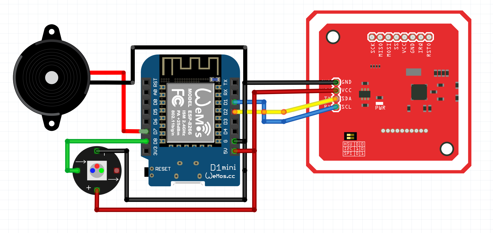

# Tag Reader for Home Assistant

The tag reader is a simple to build/use NFC tag reader, specially created for [Home Assistant](https://www.home-assistant.io). It is using a D1 mini ESP 8266 and the PN532 NFC module. The firmware is built using [ESPhome](https://www.esphome.io).

> I am selling a pre-built version, a DIY version (assembly required) or just the case (use with own components). Check it out on [my website](https://adonno-crafts.myshopify.com/).

## Building the tag reader

To build your own tag reader, you need the following components:

 - [ESP8266 D1 Mini](https://s.click.aliexpress.com/e/_d8l72oB)  
 - [PN532 NFC Reader](https://s.click.aliexpress.com/e/_dZNORIJ)
 - [WS2812](https://s.click.aliexpress.com/e/_d82GRqr)
 - [Buzzer](https://s.click.aliexpress.com/e/_dZ5F5yj)

The 3D models for the case are [here](STLs).

**WARNING** regarding AZdelivery D1. We have had several users contacting us with different issues, we don't recommend using these boards and won't provide support for them. 

### Connecting the components

There are not too many components to connect, but it does require soldering. You will need the following:

- [Solder](https://s.click.aliexpress.com/e/_dT3S62j)
- [Soldering iron with a fairly thin tip](https://s.click.aliexpress.com/e/_dXaI6nz)
- [About 40cm of thin wire (at least 5 different colors)](https://s.click.aliexpress.com/e/_dZvoYoB)

Also make sure that you have set the switches on the PN532 to the following:
- Switch 1: On (up)
- Switch 2: Off (down)

This enables the PN532 module to communicate with the D1 over I2C, and is required for the modules to work together!

To flash the reader firmware to your D1 Mini you point ESPHome at [tagreader.yaml](tagreader.yaml).  
> :warning: The tag reader requires the *beta* version of ESPHome until `1.16.0` is released with the `pn532_i2c` component.

If you're new to ESPHome, we recommend that you use the [ESPHome Beta Home Assistant add-on](https://esphome.io/guides/getting_started_hassio.html).

## Configuring for use with Home Assistant

The tag reader requires [Home Assistant](https://www.home-assistant.io) 0.115 or later.

If the tag reader is unable to connect to a wifi network, it will start a WiFi access point with a captive portal to allow you to enter your WiFi credentials.

The tag reader will be automatically discovered by Home Assistant once the tag reader is connected to the same network. You can follow the instructions in the UI to set it up.

## Usage

Scanned tags can be managed from the tags interface in Home Assistant. You can find it under config -> tags.

## Disclamer

We use aliexpress affiliate links for the components and the tools. Some Ad-blockers might block these links an thus they seem to appear broken. You will have to temporarely disable ad-blocker to open these links. 
